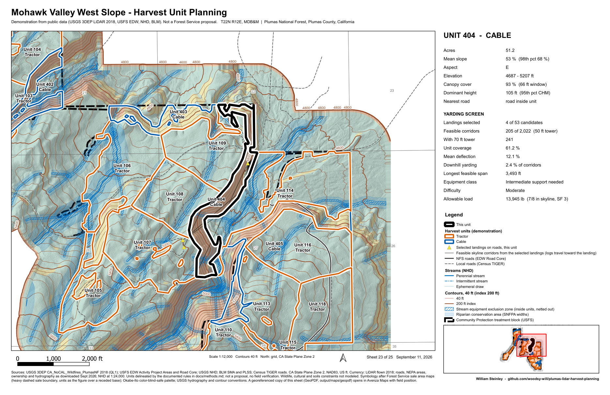
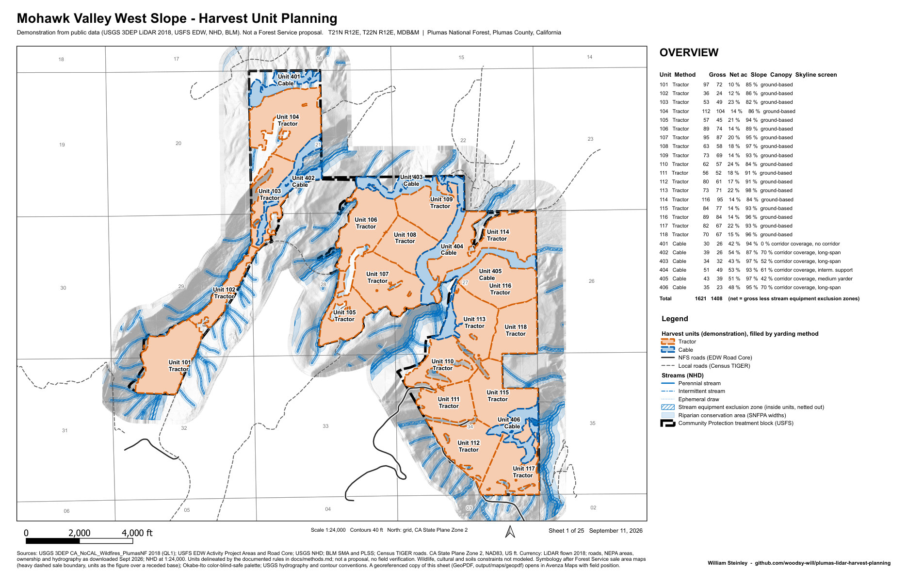
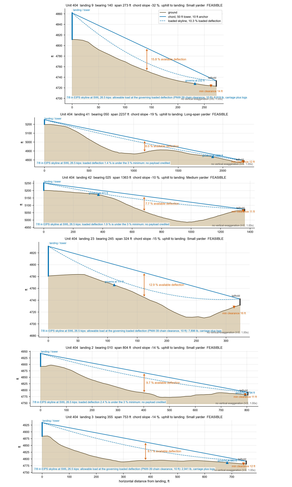
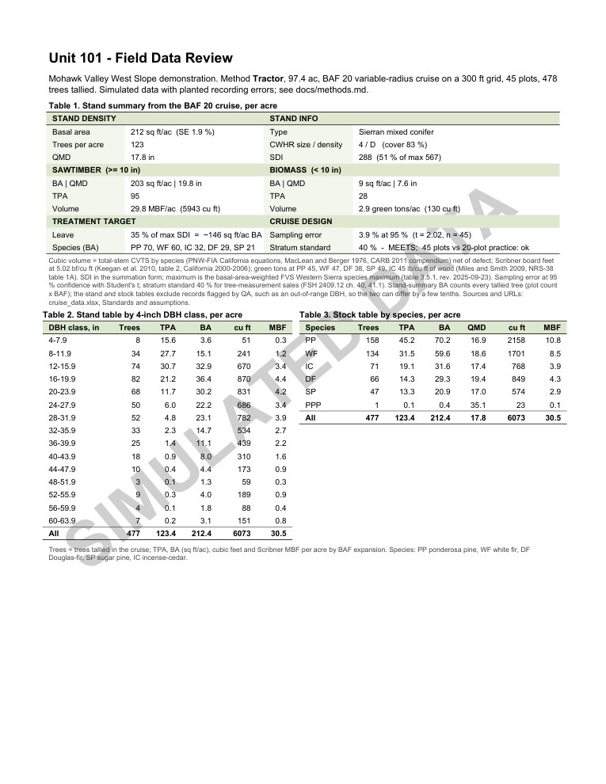
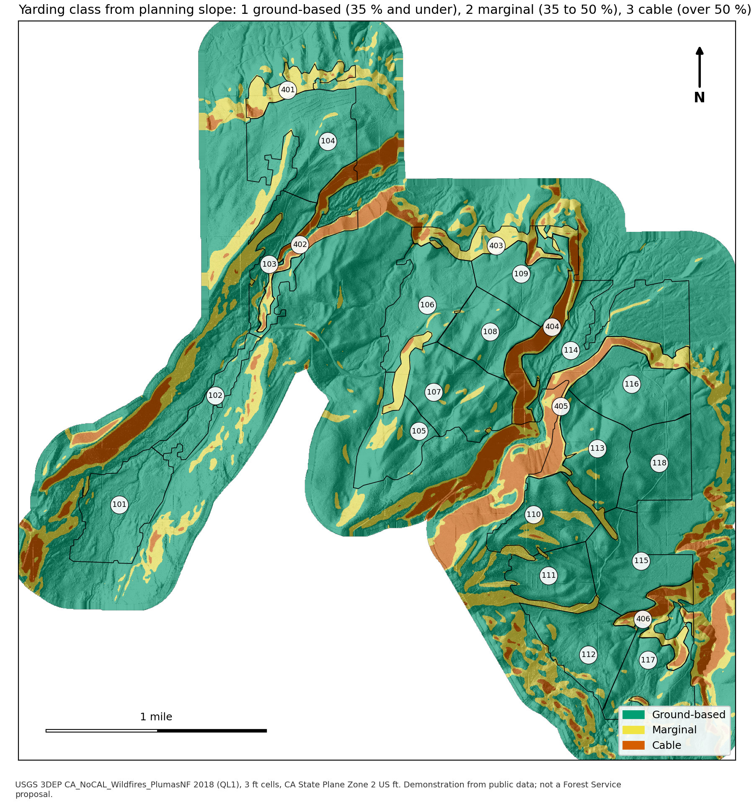

# Mohawk Valley West Slope: LiDAR-based harvest-unit planning

A self-directed rebuild, on public data only, of the harvest-planning workflows I ran as a Forester III on the
Plumas National Forest Community Protection Project: LiDAR terrain and canopy products, harvest-unit layout,
cable-yarding feasibility, an 11x17 unit map series, and field-data quality review sheets.

**Framing, stated plainly.** I did this kind of work for a contractor on federal timber sales in this
landscape. The deliverables from that work belong to the contractor and the Forest Service, so none of them
appear here. Everything in this repository was written from scratch and computed from public sources.
The harvest units are demonstration polygons delineated by the documented rules in `docs/methods.md`;
they are not a Forest Service proposal, and no field verification has been done.



| Overview sheet | Skyline profiles, unit 404 | Field-data review, unit 101 | Yarding class |
|---|---|---|---|
|  |  |  |  |

## Area

The Community Protection (Central and West Slope, decision signed 2025) treatment block on National Forest
land nearest Whitehawk Ranch, Clio, California: 1,816 acres on the west slope of Mohawk Valley, buffered
300 m for terrain context. The selection rule is deterministic in `scripts/01_get_data.py`.

## Public inputs

| Layer | Source |
|---|---|
| Treatment block | USFS EDW Activity Project Areas (NEPA) |
| Ownership | BLM Surface Management Agency, USFS layer |
| Roads | USFS EDW Road Core, supplemented by Census TIGER local roads |
| Streams, waterbodies | USGS National Hydrography Dataset |
| PLSS | BLM CadNSDI |
| LiDAR | USGS 3DEP CA_NoCAL_Wildfires_PlumasNF 2018, QL1, read from the USGS Entwine copy on Amazon |

## Results

### Terrain and canopy (3 ft cells, California State Plane Zone 2, US ft)

| | |
|---|---|
| Area processed | 3,948 ac, 650 million points |
| Elevation | 4,459 to 6,177 ft |
| Planning slope, median | 22 % |
| Ground below 35 % slope | 75 % of the area; 15 % marginal; 10 % cable ground above 50 % |
| Canopy cover, mean | 79 % |
| Canopy height, 95th percentile | 105 ft |

A raw 3 ft slope surface under this canopy averages 87 %, which is interpolation noise, not terrain. The
planning slope is computed from a smoothed DTM and averaged over 99 ft; that distinction decides every
yarding class in the project.

### Harvest units

24 demonstration units on 1,621 acres inside the 1,816 acre block.

| Method | Units | Acres | Mean slope |
|---|---|---|---|
| Tractor | 18 | 1,390 | 10 to 24 % |
| Cable | 6 | 231 | 42 to 54 % |

Units are 30 to 116 acres, split along ridges and draws, with stream equipment-exclusion zones kept inside
the boundary as an internal restriction and netted out of treatable acres.

### Cable-yarding screen

8,540 corridors were cast from 314 candidate landings on the 240 road points within reach of a unit, drawn from 940 road points sampled every 200 ft. For the six cable units:

| Unit | Acres | Feasible corridors | Coverage | Equipment class | Difficulty |
|---|---|---|---|---|---|
| 401 | 30 | 0 of 68 | 0 % | no feasible corridor from any landing within 2,000 ft | High: needs a spur road or a different system |
| 402 | 39 | 182 of 374 | 70 % | long-span yarder | Moderate |
| 403 | 34 | 124 of 551 | 52 % | long-span yarder | Moderate |
| 404 | 51 | 205 of 2,022 | 61 % | intermediate support needed | Moderate |
| 405 | 43 | 261 of 1,464 | 42 % | medium yarder | Moderate |
| 406 | 35 | 9 of 41 | 70 % | long-span yarder | Moderate |

The same screen runs on the tractor units as a check; their results are reported on the sheets as what
would happen if cable were required. Each unit also gets a profile sheet (best corridor from each selected
landing, with chord, mid-span deflection and minimum clearance drawn), and, where any corridor is feasible, a route table of distinct settings
with chord slope and yarding direction, and external and average yarding distances as the Forest Service
*Cable Logging Systems* guide defines them. Each feasible corridor also carries an allowable mid-span load on a
7/8 in skyline at a safety factor of 3, computed by the rigid-link statics of the Forest Service *Skyline
Tension and Deflection Handbook* and checked against its tables. Sale-level figures cover slope by unit,
deflection across all corridors, equipment class, difficulty, an equipment-selection matrix of span against
chord slope, yarding direction by unit, and payload against span.

### Field-data review

A simulated BAF 20 cruise on a 300 ft grid: 798 plots, 8,722 trees, six planted recording errors. The QA
pass caught all six and raised one further flag. Each unit gets a review sheet with stand density (basal
area with sampling error, trees per acre, QMD, stand density index against the mixed-conifer maximum),
CWHR size and density class, a sawtimber versus biomass split, a leave target at 35 % of the basal-area-weighted
FVS maximum SDI, a stand table by DBH class, a stock table by species, and a cruise design check with Student's t
against the FSH 2409.12 standards (40 % per stratum, exhibit 01 for the sale as a whole), a plot map, and the
findings a crew lead would hand back. Every page carries a SIMULATED DATA watermark, the cruiser code is SIM,
and the workbook opens with a READ ME sheet saying the same. A sale-level QA page opens the merged review PDF;
every unit meets the stratum standard, the sale as a whole meets its 10 % standard (placed with the Region 5
FY2025 sold average of $33.63/MBF), and four units fall short of the Region 5 20-plot practice minimum.

### Standards followed

Map layout after Forest Service sale area maps: units colored by yarding method (pale fills with a dashed dark
outline on the overview, cased outlines on the unit sheets), treatment block boundary,
streamcourse protection, roads with numbers, 40 ft contours with 200 ft index, PLSS with township and
range, unit table, 11x17, as vector print PDF (300 dpi rasters) and as GeoPDF for Avenza. Symbology
reworked against a current Forest Service sale area map, Patterson's relief-shading guidance, Jenny and Kelso's
color-vision recommendations and USGS topographic conventions (table in `docs/methods.md`). Okabe-Ito color-blind-safe palette
throughout. GeoPackage deliverable with layer descriptions and FGDC / ISO 19115 summary metadata
(`docs/data_dictionary.md`). Output checked against print, web, WCAG contrast and color-vision standards
by measurement (table in `docs/methods.md`). Cable screen definitions and the downhill-yarding rule from the Forest Service
*Cable Logging Systems* guide; deflection and tension relationship from the *Best Practice Guidelines for
Cable Logging* (FITEC). Stream widths from the Sierra Nevada Forest Plan Amendment. Canopy threshold at
the ASPRS 2 m vegetation boundary. Details and citations in `docs/methods.md`.

## Outputs

Large deliverables (the merged map series, the GeoPDFs, the individual print sheets, the 300 dpi cable
figures and the packaged rasters) are attached to the
[v1.0 release](https://github.com/woodsy-will/plumas-lidar-harvest-planning/releases/tag/v1.0) rather than
kept in git. JPEG previews of everything are in `output/previews`.

| Folder | Contents |
|---|---|
| `output/maps` | per-sheet print PDF (vector text, 300 dpi) and 150 dpi PNG; `geopdf/` field copies for Avenza; `Unit_Map_Series.pdf` merged (release asset, not in git) |
| `output/cable` | `unit_summary.csv`, per-unit profile sheets, route tables and corridor maps, seven sale-level figures |
| `output/review` | per-unit review PDFs, `Unit_Reviews.pdf` with the sale-level QA page, `cruise_data.xlsx`, `qa_summary.csv` |
| `output/gis` | `mohawk_west_slope.gpkg` (all vector products, described and with project metadata) and four decision rasters |
| `output/quicklooks` | terrain and canopy products with legends, scale bar and unit outlines |
| `output/previews` | JPEG previews of everything above, with `INDEX.md` |
| `data/work` | GeoTIFF products, `planning.gpkg`, `cable.gpkg`, `cruise_plots.gpkg` (not in git) |

## Pipeline

| Script | Output |
|---|---|
| `01_get_data.py` | public vectors to `data/raw`, including Census TIGER county roads clipped to the area; skips any file already present; `ept_fetch.py` pulls the LiDAR nodes |
| `02_build_terrain.py` | DTM, DSM, CHM, slope, planning slope, aspect, hillshade, cover, dominant height, yarding class |
| `02b_quicklooks.py` | color quicklooks of the products |
| `02c_relief_tint.py` | pre-composed relief tint (hillshade x pale yarding-class tints) for the unit sheets |
| `03_delineate_units.py` | demonstration units, riparian and exclusion buffers, clipped streams, 40 ft contours, operable mask |
| `04_cable_analysis.py` | landings, corridors, per-unit skyline feasibility |
| `04b_cable_figures.py` | profile sheets, route tables, corridor maps, all sale-level figures, EYD and AYD, from the saved corridors |
| `05_unit_maps.py` | 11x17 unit map series and overview, print PDF and GeoPDF (PyQGIS) |
| `06_review_sheets.py` | simulated cruise, QA checks, review sheets, Excel workbook |
| `07_previews.py` | JPEG previews and index |
| `08_package_gis.py` | distributable GeoPackage with metadata, packaged rasters |

Runs on QGIS 3.44's bundled Python (GDAL, PDAL, NumPy, SciPy, PyQGIS, matplotlib, ReportLab, openpyxl, pypdf, PyMuPDF, Pillow).
No ArcGIS required. The full run from download to previews takes about two hours on a laptop.

## How to run

Every script runs on the Python bundled with QGIS 3.44 (`python-qgis-ltr.bat` on Windows). From the repository
root, in order:

```
set PY="C:\Program Files\QGIS 3.44.12\bin\python-qgis-ltr.bat"
%PY% scripts\01_get_data.py          & rem public vectors to data/raw (idempotent)
%PY% scripts\ept_fetch.py            & rem LiDAR nodes to data/raw/ept (4.3 GB), node list to data/work
%PY% scripts\02_build_terrain.py     & rem about 2 h; use --max-batches N to run in chunks
%PY% scripts\02b_quicklooks.py & %PY% scripts\02c_relief_tint.py
%PY% scripts\03_delineate_units.py
%PY% scripts\04_cable_analysis.py    & rem about 12 min
%PY% scripts\04b_cable_figures.py
%PY% scripts\05_unit_maps.py         & rem ONLY_UNITS="404 101" renders a subset
%PY% scripts\06_review_sheets.py
%PY% scripts\07_previews.py & %PY% scripts\08_package_gis.py
```

## Software

QGIS 3.44.12 (PyQGIS), GDAL 3.13, PDAL 2.10, Python 3.12, NumPy, SciPy, matplotlib, ReportLab, openpyxl,
pypdf, PyMuPDF, Pillow, all as shipped with QGIS 3.44. No ArcGIS required. Developed on Windows 11;
the scripts reference the QGIS install path and the Windows Fonts folder for Arial.

## License and citation

Code: MIT (`LICENSE`). Maps, figures, review sheets and packaged data: CC BY 4.0 (`LICENSE-MAPS-DATA.md`),
which also lists the terms of each public input. Cite with `CITATION.cff` or as:
William Steinley (2026), *Mohawk Valley West Slope: LiDAR-based harvest-unit planning*, v1.0,
https://github.com/woodsy-will/plumas-lidar-harvest-planning. Contact: through https://woodsy-will.github.io/.

## Limitations

Read the outputs with these in mind.

- **The cruise is simulated.** Every plot and tree is generated from the LiDAR canopy metrics with planted
  recording errors, and every review sheet, the workbook and the QA table say so. The statistics are real
  computations on made-up data.
- **The cable screen is a screen.** A straight chord from a 50 ft tower to a 10 ft anchor with a clearance and
  deflection test sorts corridors; the payload figure is the handbook's rigid-link planning estimate at the
  available deflection, with no catenary, carriage weight, multispan or intermediate-support analysis. It
  ranks settings; it does not size a yarder.
- **The unit rules are a demonstration method.** Splitting large regions by k-means on position, elevation
  and aspect is a rule written for this project to imitate how a layout forester follows ridges and draws;
  it is not an established industry procedure.
- **Volumes follow published equations, not a compiler.** Cubic volume uses the PNW-FIA tarif equations by
  species (MacLean and Berger 1976, as compiled by the California Air Resources Board), board feet the
  California Scribner ratio of 5.02 per cubic foot of bole wood (Keegan et al. 2010), and biomass the green
  densities of Miles and Smith 2009. The standards sheet in the workbook lists each constant, its source and URL.
- **Inputs are taken as published.** NHD stream classes drive the exclusion zones and net acres without
  field verification; Census TIGER roads can include roads that no longer exist on the ground; the LiDAR
  omits the coarsest octree levels (about 0.5 % of points).
- **Nothing is field verified**, and the units, corridors and plots must not be used for operations.

## What I would do differently

- Replace the NHD stream classes with a field-verified channel classification before any boundary is
  final; NHD codes many small draws as perennial here.
- Add the constraints only the project record supplies: protected activity centers, cultural sites, soils
  and existing skid trails. The units are drawn without them.
- Design the skyline corridors to actual tailhold trees and intermediate supports rather than a 100 ft
  offset past the boundary, and cost the landings.
- Build the units with a crew on the ground. The layout rules here reproduce how a layout forester reads
  terrain, not the walk that confirms it.
